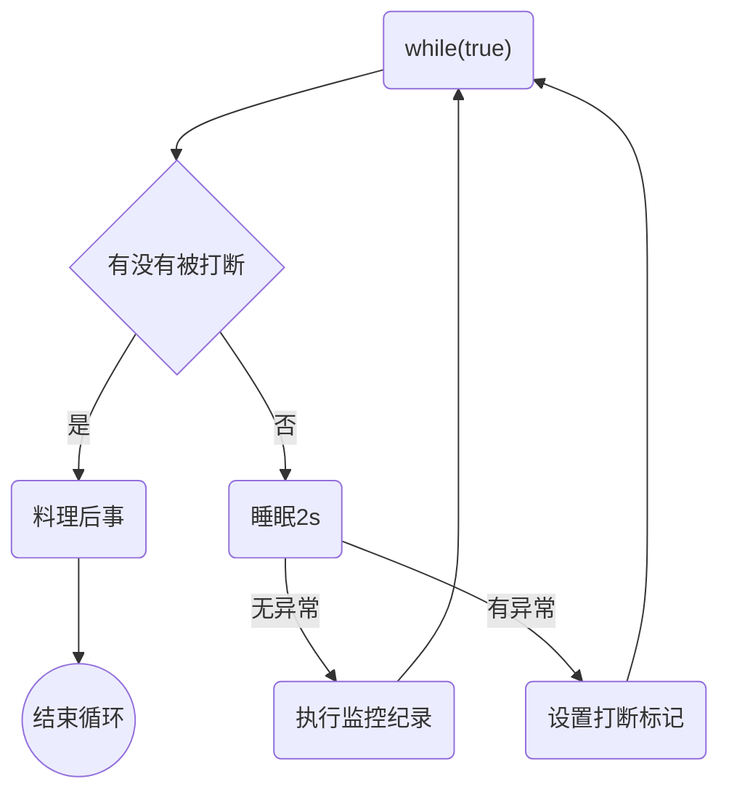

# Java线程

## 创建线程的三种方式

### Thread

`Thread`创建线程方式：创建线程类，匿名内部类方式

* **`start()`方法底层其实是给处理器注册当前线程，并且触发`run()`方法执行。**
* 线程的启动必须调用`start()`方法，如果线程直接调用`run()`方法，相当于变成了普通类的执行，此时主线程将只有执行该线程。
* 建议线程先创建子线程，主线程的任务放在之后，否则主线程（main）永远是先执行完。


`Thread`构造器：

* `public Thread()`
* `public Thread(String name)`

```java
/**
 * 线程创建方式1：实现 Thread#run() 方法
 */
@Slf4j(topic = "c.CreateWay1")
public class CreateWay1 {
    public static void main(String[] args) {
        // 创建线程对象
        Thread t1 = new Thread("t1") {
            @Override
            public void run() {
                log.debug("runing");
            }
        };
        // 启动线程
        t1.start();

        log.debug("runing"); // 主线程
    }
}
```


继承`Thread`类的优缺点：

* 优点：编码简单
* 缺点：线程类已经继承了 Thread 类无法继承其他类了，功能不能通过继承拓展（单继承的局限性）


### Runnable

`Runnable`创建线程方式：创建线程类，匿名内部类方式

`Thread`的构造器：

* `public Thread(Runnable target)`
* `public Thread(Runnable target, String name)`

```java
/**
 * 线程创建方式2：实现 Runnable 接口
 */
@Slf4j(topic = "c.CreateWay2")
public class CreateWay2 {
    public static void main(String[] args) {
        // 创建线程
        Thread t1 = new Thread(() -> log.debug("running") , "t1");
        // 启动线程
        t1.start();
        log.debug("running");
    }
}
```


**`Thread`类本身也是实现了`Runnable`接口**，`Thread`类中持有`Runnable`的属性，执行线程`run()`方法底层是调用`Runnable#run`：

```java
// 源码
public class Thread implements Runnable {
    private Runnable target;
    ...
    public void run() {
        if (target != null) {
          	// 底层调用的是 Runnable 的 run 方法
            target.run();
        }
    }
}
```

`Runnable`方式的优缺点：

* 缺点：代码复杂一点。

* 优点：

  1. 线程任务类只是实现了`Runnable`接口，可以继续继承其他类，避免了单继承的局限性。

  2. 同一个线程任务对象可以被包装成多个线程对象。

  3. 适合多个线程去共享同一个资源。

  4. 实现解耦操作，线程任务代码可以被多个线程共享，线程任务代码和线程独立。

  5. 线程池可以放入实现`Runnable`或`Callable`线程任务对象

​     


### Callable

实现`Callable`接口：

1. 定义一个线程任务类实现 Callable 接口，声明线程执行的结果类型。
2. 重写线程任务类的call()方法，这个方法可以直接返回执行的结果。
3. 创建一个`Callable`的线程任务对象。
4. 把`Callable`的线程任务对象**包装成一个未来任务对象**。
5. 把未来任务对象包装成线程对象。
6. 调用线程的`start()`方法启动线程。

`public FutureTask(Callable<V> callable)`：未来任务对象，在线程执行完后得到线程的执行结果

* `FutureTask`就是`Runnable`对象，因为**`Thread`类只能执行`Runnable`实例的任务对象**，所以把`Callable`包装成未来任务对象
* 线程池部分详解了`FutureTask`的源码

`public V get()`：「同步」等待`task`执行完毕的结果，如果在线程中获取另一个线程执行结果，会阻塞等待，用于线程同步

* get() 线程会阻塞等待任务执行完成
* run() 执行完后会把结果设置到 FutureTask  的一个成员变量，get() 线程可以获取到该变量的值

优缺点：

* 优点：同`Runnable`，并且**能得到线程执行的结果**
* 缺点：编码复杂

```java
public class ThreadDemo {
    public static void main(String[] args) {
        Callable call = new MyCallable();
        FutureTask<String> task = new FutureTask<>(call);
        Thread t = new Thread(task);
        t.start();
        try {
            String s = task.get(); // 获取call方法返回的结果（正常/异常结果）
            System.out.println(s);
        }  catch (Exception e) {
            e.printStackTrace();
        }
    }

public class MyCallable implements Callable<String> {
    @Override//重写线程任务类方法
    public String call() throws Exception {
        return Thread.currentThread().getName() + "->" + "Hello World";
    }
}
   
```


## 线程方法

### Thread类常用API


|    修饰符     | 返回值  | 方法名                    | 说明                                                         | 注意                                                         |
| :-----------: | :-----: | ------------------------- | ------------------------------------------------------------ | ------------------------------------------------------------ |
|               |  void   | start()                   | 启动一个新线程，Java虚拟机调用此线程的 run 方法              | start方法只是让线程进入就绪状态，是否运行取决于任务调度器。<br>每个线程对象的`start()`方法只能调用一次，否则会抛出`IllegalThreadStateException`异常 |
|               |  void   | run()                     | 线程启动后调用该方法                                         | 如果在构造`Thread`对象时传入了`Runnable`实现类对象，则线程启动后会运行该对象的`run()`方法。<br>如果构造器未传入参数，则默认不执行任何操作（见`Thread#run()`方法的源码），可以继承`Thread`并重写`run`方法，来覆盖默认行为。 |
|               |  void   | setName(String name)      | 给当前线程取名字                                             |                                                              |
|               |  void   | getName()                 | 获取当前线程的名字<br />线程存在默认名称：子线程是 Thread-索引，主线程是 main |                                                              |
|    static     | Thread  | currentThread()           | 获取当前线程对象，代码在哪个线程中执行                       |                                                              |
|    static     |  void   | sleep(long time)          | 让当前线程休眠多少毫秒再继续执行<br />**Thread.sleep(0)** : 让操作系统立刻重新进行一次 CPU 竞争 |                                                              |
| static native |  void   | yield()                   | 提示线程调度器让出当前线程对 CPU 的使用                      |                                                              |
|     final     |   int   | getPriority()             | 返回此线程的优先级                                           |                                                              |
|     final     |  void   | setPriority(int priority) | 更改此线程的优先级，常用 1 5 10                              | `java`中规定线程优先级是`1~10` 的整数，较大的优先级能提高该线程被`CPU`调度的机率 |
|               |  State  | getState()                | 获取当前线程的状态                                           | State: NEW, RUNNABLE, BLOCKED, WAITING, TIMED_WAITING, TERMINATED |
|               |  void   | interrupt()               | 中断这个线程，异常处理机制                                   |                                                              |
|               | boolean | isInterrupted()           | 判断当前线程是否被打断，不清除打断标记                       |                                                              |
|    static     | boolean | interrupted()             | 判断当前线程是否被打断，清除打断标记                         |                                                              |
|     fianl     |  void   | join()                    | 等待这个线程结束                                             |                                                              |
|     final     |  void   | join(long millis)         | 等待这个线程死亡 millis 毫秒，0 意味着永远等待               |                                                              |
| final native  | boolean | isAlive()                 | 线程是否存活（还没有运行完毕）                               |                                                              |
|     fianl     |  void   | setDaemon(boolean on)     | 将此线程标记为守护线程或用户线程                             |                                                              |


### run和start

```java
/**
 * 测试调用 start 和 run 方法的区别
 */
@Slf4j(topic = "c.StartAndRun")
public class StartAndRun {
    /**
     * 用于测试: Thread#Run()
     */
    @Test
    public void testRun() {
        Thread t1 = new Thread("t1") {
            @Override
            public void run() {
                log.debug("running...");
            }
        };
        t1.run(); // 同步调用，仍然是 main 线程调用的 run 方法
        log.debug("running...");
    }


    /**
     * 用于测试: Thread#start()
     */
    @Test
    public void testStart() {
        Thread t2 = new Thread("t2") {
            @Override
            public void run() {
                log.debug("running...");
            }
        };
        t2.start(); // 异步调用，由t2线程调用run方法
        log.debug("running...");
    }
}
```


`run()`：称为线程体，包含了要执行的这个线程的内容，方法运行结束，此线程随即终止。直接调用`run()`是在「主线程」中执行了`run()`，没有启动新的线程，需要顺序执行。

`start()`：使用`start()`是启动新的线程，此线程处于就绪（可运行）状态，通过新的线程间接执行`run`中的代码的

说明：**线程控制资源类**

`run()`方法中的异常不能抛出，只能`try/catch`

* 因为父类中没有抛出任何异常，子类不能比父类抛出更多的异常
* **异常不能跨线程传播回 main() 中**，因此必须在本地进行处理


### sleep和yield

#### sleep

* 调用 `sleep()` 会让当前线程从`Running`进入`Timed Waiting`状态（阻塞）

  ```java
  @Slf4j(topic = "c.TestSleep")
  public class TestSleep {
  
      /**
       * 测试 sleep 前后线程状态的变化
       */
      @Test
      public static void test1(String[] args) {
          Thread t1 = new Thread("t1") {
              @Override
              public void run() {
                  try {
                      Thread.sleep(1000);
                  } catch (InterruptedException e) {
                      log.debug("{} interrupted",Thread.currentThread().getName());
                  }
              }
          };
          log.debug("t1 status: {}", t1.getState());    // t1 status: NEW
          t1.start();
          log.debug("t1 status: {}", t1.getState());    // t1 status: RUNNABLE
          try {
              Thread.sleep(500);
          } catch (InterruptedException e) {
              log.debug("{} interrupted",Thread.currentThread().getName());
          }
          log.debug("t1 status: {}", t1.getState());   // t1 status: TIMED_WAITING
      }
  }
  ```

* `sleep()` 方法的过程中，**线程不会释放对象锁**

* 其它线程可以使用 `interrupt` 方法打断正在睡眠的线程，这时 `sleep()` 方法会抛出 `InterruptedException`

* 睡眠结束后的线程未必会立刻得到执行，需要抢占 CPU

* **建议用 `TimeUnit#sleep`代替 `Thread#sleep()`来获得更好的可读性**

  ```java
  @SneakyThrows
  @Test
  public void test3() {
      Thread t3 = new Thread("t3") {
          @SneakyThrows
          @Override
          public void run() {
              log.debug("enter sleep...");
              TimeUnit.SECONDS.sleep(1);  // 睡眠 1s
              log.debug("wake up");
          }
      };
      t3.start();
      t3.join();  // 不加 join，则 main 线程执行完毕后直接退出，不会输出 wake up
  }
  ```

#### yield

* 调用`yield()`会让提示线程调度器让出当前线程对 CPU 的使用，使得当前线程从`Running`进入`Runnable`状态。
* 具体的实现依赖于操作系统的任务调度器。
* **会放弃 CPU 资源，锁资源不会释放。**


### join

`public final void join()`：等待这个线程结束

原理：调用者轮询检查线程 `alive` 状态，`t1.join()` 等价于：

```java
public final synchronized void join(long millis) throws InterruptedException {
    // 调用者线程进入 thread 的 waitSet 等待, 直到当前线程运行结束
    while (isAlive()) {
        wait(0);
    }
}
```

* join 方法是被 `synchronized `修饰的，本质上是一个对象锁，其内部的 wait 方法调用也是释放锁的，但是**释放的是当前的线程对象锁，而不是外面的锁**

* 当调用某个线程（t1）的 join 方法后，该线程（t1）抢占到 CPU 资源，就不再释放，直到线程执行完毕

线程同步：

* join 实现线程同步，因为会阻塞等待另一个线程的结束，才能继续向下运行
  * 需要外部共享变量，不符合面向对象封装的思想
  * 必须等待线程结束，不能配合线程池使用
* Future 实现（同步）：get() 方法阻塞等待执行结果
  * main 线程接收结果
  * get 方法是让调用线程同步等待

```java
public class Test {
    static int r = 0;
    public static void main(String[] args) throws InterruptedException {
        test1();
    }
    private static void test1() throws InterruptedException {
        Thread t1 = new Thread(() -> {
            try {
                Thread.sleep(1000);
            } catch (InterruptedException e) {
                e.printStackTrace();
            }
            r = 10;
        });
        t1.start();
        t1.join();//等待线程执行结束，输出的10
        System.out.println(r);
    }
}
```


### interrupt

#### 打断线程

`public void interrupt()`：打断这个线程，异常处理机制

`public static boolean interrupted()`：判断当前线程是否被打断，打断返回 true，**清除打断标记**，连续调用两次一定返回 false

`public boolean isInterrupted()`：判断当前线程是否被打断，不清除打断标记

打断的线程会发生上下文切换，操作系统会保存线程信息，抢占到 `CPU` 后会从中断的地方接着运行（打断不是停止）

* sleep、wait、join 方法都会让线程进入阻塞状态，打断线程**会清空打断状态**（false）

  ```java
  // 案例1：sleep，wait, join 被 interrupt 打断时，会将打断标记重置为 false
  private static void method1() throws InterruptedException {
      Thread t1 = new Thread(() -> {
          try {
              log.debug("sleep...");
              Thread.sleep(5000);
          } catch (InterruptedException e) {
              // sleep，wait, join 被打断后会在异常处理期间将打断标记置位 false;
              e.printStackTrace();
          }
      }, "t1");
  
      t1.start();
      Thread.sleep(1000);
      log.debug("interrupting...");
      t1.interrupt();
      // Thread.sleep(1000);
      // 如果输出在异常处理之前，则打断标记为true，如果输出在异常处理之后，则打断标记为false，可以通过打开上一行代码进行测试
      log.debug("flag of interrupted sleep: {}", t1.isInterrupted());
  }
  ```

* 打断正常运行的线程：不会清空打断状态（true）

  ```java
  // 案例2：正常运行的代码被打断时，打断标记为 true，不会重置
  private static void method2() throws InterruptedException {
      Thread t1 = new Thread(() -> {
          for (; ; ) {
              Thread ct = Thread.currentThread();
              if (ct.isInterrupted()) {  // isInterrupted 调用后，不会重置打断标记
                  log.debug("interrupted: {}", ct.isInterrupted());
                  break;
              }
          }
      }, "t1");
      t1.start();
      Thread.sleep(1000);
      t1.interrupt();
  }
  ```

#### 打断 park

park 作用类似 sleep，打断 park 线程，不会清空打断状态（true）

```java
// 案例3：Thread.interrupted() 和 LockSupport.park()
// LockSupport.park() 与 Thread#sleep() 方法类似，使当前线程进入休眠，除非打断标记为true。
// Thread.interrupted() 会返回当前线程的打断标记，并重写置为 false。
// 上面两个方法配合使用：
private static void method3() throws InterruptedException {
    Thread t1 = new Thread(() -> {

        log.debug("park1...");
        LockSupport.park();
        log.debug("unpark1...");
        Thread ct = Thread.currentThread();
        // log.debug("打断标记: {}", ct.isInterrupted());  // true，不重置为 false，后面再调用 park 则不会生效
        log.debug("打断标记: {}", Thread.interrupted()); // true，重置为 false，后面再调用 park 依然生效

        log.debug("park2...");
        LockSupport.park();
        log.debug("unpark2...");

    }, "t1");


    t1.start();
    TimeUnit.SECONDS.sleep(1);
    t1.interrupt();
}
```


### 不推荐

不推荐使用的方法，这些方法已过时，容易破坏同步代码块，造成线程死锁：

* `public final void stop()`：停止线程运行

  废弃原因：方法粗暴，除非可能执行 finally 代码块以及释放 synchronized 外，线程将直接被终止，如果线程持有 JUC 的互斥锁可能导致锁来不及释放，造成其他线程永远等待的局面

* `public final void suspend()`：**挂起（暂停）线程运行**

  废弃原因：如果目标线程在暂停时对系统资源持有锁，则在目标线程恢复之前没有线程可以访问该资源，如果**恢复目标线程的线程**在调用 resume 之前会尝试访问此共享资源，则会导致死锁

* `public final void resume()`：恢复线程运行


## 主线程和守护线程


默认情况下，Java 进程需要等待所有线程都运行结束，才会结束。有一种特殊的线程叫做「守护线程」，只要其它「非守护线程」运行结束了，即使守护线程的代码没有执行完，也会强制结束。  

`public final void setDaemon(boolean on)`：如果是 true ，将此线程标记为守护线程 

线程「启动前」调用此方法：

```java
// 只有当所有「非守护线程」执行完毕后，java进程才会结束。
public static void main(String[] args) {
    Thread t1 = new Thread(() -> {
        while (true) {
            Thread ct = Thread.currentThread();
            if (ct.isInterrupted()) {
                break;
            }
        }
        log.debug("end");
    }, "t1");

    t1.setDaemon(true); // 设置 t1 为守护线程
    t1.start();
    log.debug("end");
}
```


用户线程：平常创建的普通线程

守护线程：服务于用户线程，只要其它非守护线程运行结束了，即使守护线程代码没有执行完，也会强制结束。守护进程是**脱离于终端并且在后台运行的进程**，脱离终端是为了避免在执行的过程中的信息在终端上显示

说明：当运行的线程都是守护线程，Java 虚拟机将退出，因为普通线程执行完后，JVM 是守护线程，不会继续运行下去

常见的守护线程：

* 垃圾回收器线程就是一种守护线程
* Tomcat 中的 Acceptor 和 Poller 线程都是守护线程，所以 Tomcat 接收到 shutdown 命令后，不会等待它们处理完当前请求


## 线程原理

### 运行机制

**Java虚拟机栈**（Java Virtual Machine Stacks）：每个线程启动后，虚拟机就会为其分配一块「栈内存」

* 每个栈由多个「栈帧（Frame）」组成，对应着每次方法调用时所占用的内存
* 每个线程只能有一个「活动栈帧」，对应着当前正在执行的那个方法
* [栈帧图解](https://www.bilibili.com/video/BV16J411h7Rd?p=21&spm_id_from=pageDriver&vd_source=1c6a218df24b9f08b6dd48151a75b178)


**线程上下文切换**（Thread Context Switch）：一些原因导致 CPU 不再执行当前线程，转而执行另一个线程

* 线程的 CPU 时间片用完
* 垃圾回收
* 有更高优先级的线程需要运行
* 线程自己调用了 `sleep、yield、wait、join、park` 等方法
* [图解上下文切换（06:00 后）](https://www.bilibili.com/video/BV16J411h7Rd?p=21&spm_id_from=pageDriver&vd_source=1c6a218df24b9f08b6dd48151a75b178)


**程序计数器**（Program Counter Register）：记住下一条 JVM 指令的执行地址，是线程私有的当 Context Switch 发生时，需要由操作系统保存当前线程的状态（保存在PCB进程控制块中），并恢复另一个线程的状态，包括程序计数器、虚拟机栈中每个栈帧的信息，如局部变量、操作数栈、返回地址等


JVM 规范并没有限定线程模型，以 HotSopot 为例：

* Java 的线程是内核级线程（1:1 线程模型），每个 Java 线程都映射到一个操作系统原生线程，需要消耗一定的内核资源（堆栈）
* **线程的调度是在内核态运行的，而线程中的代码是在用户态运行**，所以线程切换（状态改变）会导致用户与内核态转换进行系统调用，这是非常消耗性能

Java 中 main 方法启动的是一个进程也是一个主线程，main 方法里面的其他线程均为子线程，main 线程是这些线程的父线程


### 线程调度

线程调度指系统为线程分配处理器使用权的过程，方式有两种：「协同式线程调度」、「抢占式线程调度」（Java 选择）

协同式线程调度：线程的执行时间由线程本身控制

* 优点：线程做完任务才通知系统切换到其他线程，相当于所有线程串行执行，不会出现线程同步问题
* 缺点：线程执行时间不可控，如果代码编写出现问题，可能导致程序一直阻塞，引起系统的奔溃

抢占式线程调度：线程的执行时间由系统分配

* 优点：线程执行时间可控，不会因为一个线程的问题而导致整体系统不可用
* 缺点：无法主动为某个线程多分配时间

Java 提供了线程优先级的机制，优先级会提示（hint）调度器优先调度该线程，但这仅仅是一个提示，调度器可以忽略它。在线程的就绪状态时，如果 CPU 比较忙，那么优先级高的线程会获得更多的时间片，但 CPU 闲时，优先级几乎没作用

说明：并不能通过优先级来判断线程执行的先后顺序


### 未来优化

内核级线程调度的成本较大，所以引入了更轻量级的协程。用户线程的调度由用户自己实现（一对多的线程模型），被设计为协同式调度，所以叫协程

* 有栈协程：协程会完整的做调用栈的保护、恢复工作，所以叫有栈协程
* 无栈协程：本质上是一种有限状态机，状态保存在闭包里，比有栈协程更轻量，但是功能有限

有栈协程中有一种特例叫纤程，在新并发模型中，一段纤程的代码被分为两部分，执行过程和调度器：

* 执行过程：用于维护执行现场，保护、恢复上下文状态
* 调度器：负责编排所有要执行的代码顺序


## 线程状态

### 五状态模型

从「操作系统」层面来描述线程的状态，可以分为5种，称作「五状态模型」


#### 创建状态

- 创建进程时拥有PCB但其它资源尚未就绪的状态称为「创建状态」。

- 其它资源：进程控制块、堆空间、栈空间…


#### 就绪状态

- 当进程被分配到除CPU以外的所有必要资源后，进程就进入了「就绪状态」。

- 只要再获取到CPU的使用权，就可以立即运行。

- 就绪队列

  > 在一个系统中可以多个进程并发的执行，这就意味着当系统中有多个处于就绪状态的进程时，通常会排成一个队列，也称作**就绪队列**。

  

#### 执行状态

- 进程获得CPU资源时，其程序正在执行就称为「执行状态」。
- 在单处理机（单核cpu）中，在某个时刻只能由一个进程是处于执行状态。

#### 阻塞状态

进程因为某种原因（如：其它设备未就绪而无法继续执行），从而放弃CPU的状态称为「阻塞状态」。

- 阻塞队列

  


#### 终止状态

进程结束由系统清理或者归还PCB的状态称为「终止状态」。


### 六状态模型

这是从 `Java API` 层面来描述的，根据 `Thread.State` 枚举，分为六种状态  

线程由生到死的完整过程（生命周期）：当线程被创建并启动以后，既不是一启动就进入了执行状态，也不是一直处于执行状态，在 API 中 `java.lang.Thread.State` 这个枚举中给出了六种线程状态：

| 线程状态                   | 导致状态发生条件                                             |
| -------------------------- | ------------------------------------------------------------ |
| NEW（新建）                | 线程刚被创建，但是并未启动，还没调用 start 方法，只有线程对象，没有线程特征 |
| Runnable（可运行）         | 当调用了 start() 方法之后，线程可以在 Java 虚拟机中运行的状态。注意，Java API 层面的 RUNNABLE 状态涵盖了**操作系统**层面的「就绪状态」、「执行状态」和「阻塞状态」（由于 BIO 导致的线程阻塞，在 Java 里无法区分，仍然认为是可运行） |
| Blocked（阻塞）            | 当一个线程试图获取一个对象锁，而该对象锁被其他的线程持有，则该线程进入 Blocked 状态；当该线程持有锁时，该线程将变成 Runnable 状态 |
| Waiting（无限等待）        | 一个线程在等待另一个线程执行一个（唤醒）动作时，该线程进入 Waiting 状态，进入这个状态后不能自动唤醒，必须等待另一个线程调用 notify 或者 notifyAll 方法才能唤醒 |
| Timed Waiting （限期等待） | 有几个方法有超时参数，调用将进入 Timed Waiting 状态，这一状态将一直保持到超时期满或者接收到唤醒通知。带有超时参数的常用方法有 Thread.sleep 、Object.wait |
| Teminated（结束）          | run 方法正常退出而死亡，或者因为没有捕获的异常终止了 run 方法而死亡 |


* NEW → RUNNABLE：当调用 t.start() 方法时，由 NEW → RUNNABLE

* RUNNABLE <--> WAITING：

  * 调用 obj.wait() 方法时

    调用 obj.notify()、obj.notifyAll()、t.interrupt()：

    * 竞争锁成功，t 线程从 WAITING → RUNNABLE
    * 竞争锁失败，t 线程从 WAITING → BLOCKED

  * 当前线程调用 t.join() 方法，注意是当前线程在 t 线程对象的监视器上等待

  * 当前线程调用 LockSupport.park() 方法

* RUNNABLE <--> TIMED_WAITING：调用 obj.wait(long n) 方法、当前线程调用 t.join(long n) 方法、当前线程调用 Thread.sleep(long n)

* RUNNABLE <--> BLOCKED：t 线程用 synchronized(obj) 获取了对象锁时竞争失败


## 查看线程

Windows：

* 任务管理器可以查看进程和线程数，也可以用来杀死进程
* tasklist 查看进程
* taskkill 杀死进程

Linux：

* ps -ef 查看所有进程
* ps -fT -p <PID> 查看某个进程（PID）的所有线程
* kill 杀死进程
* top 按大写 H 切换是否显示线程
* top -H -p <PID> 查看某个进程（PID）的所有线程

Java：

* jps 命令查看所有 Java 进程
* jstack <PID> 查看某个 Java 进程（PID）的所有线程状态
* jconsole 来查看某个 Java 进程中线程的运行情况（图形界面）


## 终止模式


终止模式之两阶段终止模式：`Two Phase Termination`

目标：在一个线程 `T1` 中如何优雅终止线程 `T2`？优雅指的是给 `T2` 一个后置处理器

错误思想：

* 使用线程对象的 `stop()` 方法停止线程：`stop` 方法会真正杀死线程，如果这时线程锁住了共享资源，当它被杀死后就再也没有机会释放锁，其它线程将永远无法获取锁
* 使用 `System.exit(int)` 方法停止线程：目的仅是停止一个线程，但这种做法会让整个程序都停止。

两阶段终止模式图示：




打断线程可能在任何时间，所以需要考虑在任何时刻被打断的处理方法：

```java
@Slf4j(topic = "c.TwoStageTermination")
public class TwoPhaseTermination {

    public static void main(String[] args) throws InterruptedException {
        TwoPhaseTermination thread = new TwoPhaseTermination();
        thread.start();
        Thread.sleep(3500);
        thread.stop();
    }

    private Thread thread;

    // 开启线程
    public void start() {
        thread = new Thread(() -> {
            while (true) {
                Thread ct = Thread.currentThread();
                if (ct.isInterrupted()) {
                    log.debug("{} has been interrupted and processing some work", ct.getName());
                    // some work
                    return;
                }
                try {
                    Thread.sleep(1000);  	// sleep 被打断后会抛出异常，并将打断标记会置为 false
                    log.debug("执行代码..."); // 如果正常执行代码时被打断不会抛出异常，打断标记会被置为 true，再次进入循环时会进入 if 语句退出循环
                } catch (InterruptedException e) {
                    e.printStackTrace();
                    // 如果发生异常，则需要重新设置打断标记，再次进入循环时会进入 if 语句退出循环
                    ct.interrupt();
                }
            }
        });
        thread.start();
    }


    // 停止线程
    public void stop() {
        thread.interrupt();
    }

}
```


