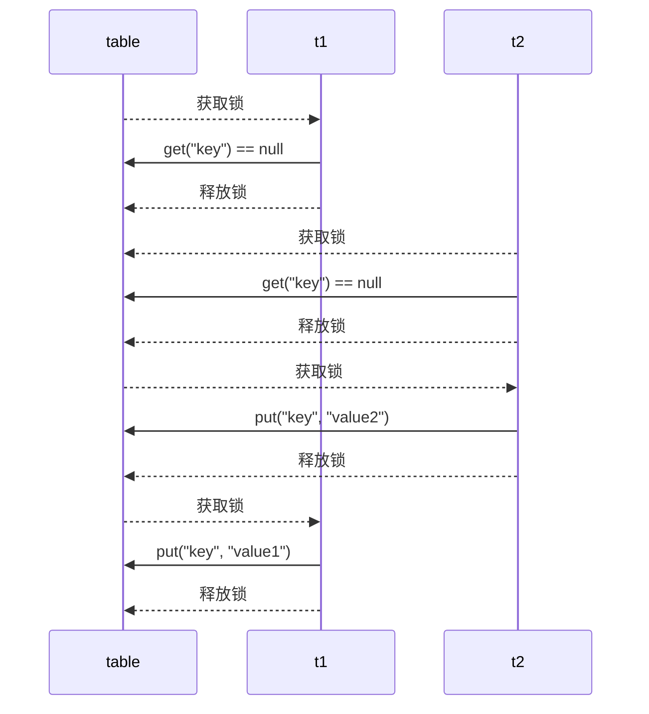

# 共享模型之管程


## 临界区

**概念：**

- 一次仅允许一个进程使用的资源成为「临界资源」

- 访问临界资源的代码块被称为「临界区」

- 多个线程在临界区内执行，由于代码的执行序列不同而导致结果无法预测，称之为发生了「竞态条件」

一个程序运行多个线程是没有问题，多个线程读共享资源也没有问题，在**多个线程对共享资源进行读写操作时发生指令交错，就会出现问题**。为了避免临界区的竞态条件发生（解决线程安全问题）：

* 阻塞式的解决方案：`synchronized`，`lock`
* 非阻塞式的解决方案：原子变量


## synchronized

`synchronized`，采用互斥的方式让同一时刻至多只有一个线程能持有「对象锁」，其它线程获取这个对象锁时会阻塞，保证拥有锁的线程可以安全的执行临界区内的代码，不用担心线程上下文切换。

`synchronized` 实际是用「对象锁」保证了临界区内代码的「原子性」，临界区内的代码对外是不可分割的，不会被线程切换所打断。  

>###### 注意
>
>互斥和同步都可以采用 `synchronized` 关键字来完成，区别：
>
>* 互斥是保证临界区的竞态条件发生，同一时刻只能有一个线程执行临界区代码
>* 同步是由于线程执行的先后、顺序不同、需要一个线程等待其它线程运行到某个点

### 使用锁

#### 同步代码块

锁对象：理论上可以是任意的唯一对象

`synchronized` 是「可重入」、「不公平」的重量级锁

原则上：

* 锁对象建议使用共享资源
* 在实例方法中使用 `this` 作为锁对象，锁住的 `this` 正好是共享资源
* 在静态方法中使用 `类名.class` 作为锁对象，因为静态成员属于类，被所有实例对象共享，所以需要锁住类

同步代码块格式：

```java
synchronized(锁对象){
	// 临界区
}
```

实例：

```java
public class Demo {
    static int counter = 0;
    //static修饰，则元素是属于类本身的，不属于对象，与类一起加载一次，只有一个
    static final Object lock = new Object();
    public static void main(String[] args) throws InterruptedException {
        Thread t1 = new Thread(() -> {
            for (int i = 0; i < 5000; i++) {
                synchronized (lock) {  // 在静态方法中也可以使用 Demo.class 作为锁
                    counter++;
                }
            }
        }, "t1");
        Thread t2 = new Thread(() -> {
            for (int i = 0; i < 5000; i++) {
                synchronized (lock) {
                    counter--;
                }
            }
        }, "t2");
        t1.start();
        t2.start();
        t1.join();
        t2.join();
        System.out.println(counter);
    }
}
```


#### 同步方法

把出现线程安全问题的核心方法锁起来，每次只能一个线程进入访问

`synchronized` 修饰的方法的不具备继承性，所以子类是线程不安全的，如果子类的方法也被 synchronized 修饰，两个锁对象其实是一把锁，而且是**子类对象作为锁**

用法：直接给方法加上一个修饰符 `synchronized`

```java
//同步方法
修饰符 synchronized 返回值类型 方法名(方法参数) { 
	// 方法体
}
//同步静态方法
修饰符 static synchronized 返回值类型 方法名(方法参数) { 
	// 方法体
}
```


同步方法底层也是有锁对象的：

* 如果方法是实例方法：同步方法默认用 `this` 作为的锁对象

  ```java
  public synchronized void test() {} //等价于
  public void test() {
      synchronized(this) {}
  }
  ```

* 如果方法是静态方法：同步方法默认用 `类名.class` 作为的锁对象

  ```java
  class Test{
  	public synchronized static void test() {}
  }
  //等价于
  class Test{
      public void test() {
          synchronized(Test.class) {}
  	}
  }
  ```


#### 线程八锁

线程八锁就是考察 `synchronized` 锁住的是哪个对象，直接百度搜索相关的实例

说明：主要关注锁住的对象是不是同一个

* 锁住类对象，所有类的实例的方法都是安全的，类的所有实例都相当于同一把锁
* 锁住 `this` 对象，只有在当前实例对象的线程内是安全的，如果有多个实例就不安全

代码：[测试线程八锁](../src/main/java/com/yrc/juc/e_共享模型之管程/Test8Locks.java)


### 锁原理

#### Java对象头

[“对象头(object header)”里知多少)](https://juejin.cn/post/6844904113306615822)

[从对象头出发了解Synchronized关键字)](https://juejin.cn/post/6844903661538115598)


**以 32 位虚拟机为例：**

- 普通对象：

  ```ruby
  |--------------------------------------------------------------|
  | 				 	Object Header (64 bits)			    	   |
  |------------------------------------|-------------------------|
  |       Mark Word (32 bits)          |  Klass Word (32 bits)   |
  |------------------------------------|-------------------------|
  ```

- 数组对象

  ```ruby
  |---------------------------------------------------------------------------------|
  |                             Object Header (96 bits)                             |
  |--------------------------------|-----------------------|------------------------|
  |       Mark Word(32bits)        |   Klass Word(32bits)  |  array length(32bits)  |
  |--------------------------------|-----------------------|------------------------|
  ```

- `Mark Word` 主要用来存储对象自身的运行时数据

- `Klass Word` 指向 `Class` 对象

**`Mark Word` 结构：**

- 32 位：

  ```ruby
  |-------------------------------------------------------|--------------------|
  |                  Mark Word (32 bits)                  |       State        |
  |-------------------------------------------------------|--------------------|
  |     hashcode:25      |   age:4   | biased_lock:0 | 01 |       Normal       |
  |-------------------------------------------------------|--------------------|
  |  thread:23 | epoch:2 |   age:4   | biased_lock:1 | 01 |       Biased       |
  |-------------------------------------------------------|--------------------|
  |                ptr_to_lock_record:30             | 00 | Lightweight Locked |
  |-------------------------------------------------------|--------------------|
  |                ptr_to_heavyweight_monitor:30     | 10 | Heavyweight Locked |
  |-------------------------------------------------------|--------------------|
  |                                                  | 11 |    Marked for GC   |
  |-------------------------------------------------------|--------------------|
  ```

  

- 64 位：

  ```ruby
  |----------------------------------------------------------------------|--------------------|
  | 			          Mark Word (64 bits)		    	               |       State        |
  |----------------------------------------------------------------------|--------------------|
  |  unused:25  |  hashcode:31 | cms_free:1 | age:4 | biased_lock:0 | 01 |       Normal       |
  |----------------------------------------------------------------------|--------------------|
  |     thread:54     |epoch:2 | cms_free:1 | age:4 | biased_lock:1 | 01 |       Biased       |
  |----------------------------------------------------------------------|--------------------|
  |                    ptr_to_lock_record:62                        | 00 | Lightweight Locked |
  |----------------------------------------------------------------------|--------------------|
  |                    ptr_to_heavyweight_monitor:62                | 10 | Heavyweight Locked |
  |----------------------------------------------------------------------|--------------------|
  |                                                                 | 11 |    Marked for GC   |
  |----------------------------------------------------------------------|--------------------|
  ```

  

#### Monitor

`Monitor` 被翻译为「监视器」或「管程」。

每个 `Java` 对象都可以关联一个 `Monitor` 对象，`Monitor` 也是 `Class`，其**实例存储在堆中**，结构如下图：


如果使用 `synchronized` 给对象上锁（重量级）之后，该对象头的 `Mark Word` 被设置为指向 `Monitor` 对象的指针，同时锁标志位置为 `01`，这就是「重量级锁」：


**工作流程：**(参考上图)

* 开始时 `Monitor` 中 `Owner` 为 `null`。
* 当 `Thread-1` 执行 `synchronized(obj)` 就会将 `obj` 的 `Mark Word` 指向与之对应的 `Monitor`，将对象原有的 `MarkWord` 存入线程栈中的锁记录中（轻量级锁部分讲解）。
* 检查发现 `Monitor` 还没有所有者，将 `Owner` 置为 `Thread-1`，此时 `Thread-1` 获取锁成功。

* 在 `Thread-1` 上锁的过程中，`Thread-2`、`Thread-3`、`Thread-4` 也执行了 `synchronized(obj)`，通过指针找到 `obj` 对应的 `Monitor` 发现已存在所有者，因此线程被存入 `EntryList` （双向链表），线程状态置为 `BLOCKED`。
* `Thread-1` 执行完同步代码块的内容，根据 `obj` 的 `Mark Word` 中的指针找到 `Monitor` ，设置 `Owner` 为空，把线程栈的锁记录中的对象头的值设置回 `Mark Word`。
* 唤醒 `EntryList` 中等待的所有线程来竞争锁，竞争是「非公平的」，如果这时有新的线程想要获取锁，可能直接就抢占到了，阻塞队列的线程就会继续阻塞。
* `WaitSet` 中的 `Thread-0`，是以前获得过锁，但条件不满足进入 `WAITING` 状态的线程（`wait-notify` 机制）


> 注意：
>
> * `synchronized` 必须是进入同一个对象的 `Monitor` 才有上述的效果。
> * 不加 `synchronized` 的对象不会关联监视器，不遵从以上规则。


#### 分析汇编指令

代码：

```java
public class LockPrinciple_Bytecode {
    // 锁对象
    static final Object lock = new Object();
    // 共享变量
    static  int counter = 0;

    public static void main(String[] args) {
        synchronized (lock) {
            counter++;
        }
    }
}
```

```java
  public static void main(java.lang.String[]);
    descriptor: ([Ljava/lang/String;)V
    flags: ACC_PUBLIC, ACC_STATIC
    Code:
      stack=2, locals=3, args_size=1
         // --synchronized 开始
         0: getstatic     #2                  // 常量池2号常量（lock 引用）入栈: Field lock:Ljava/lang/Object;
         3: dup								  // 将栈顶值复制一份重新入栈，栈中有两个 lock 引用
         4: astore_1						  // 将 lock 引用存储在局部变量表第 2 个位置中(solt 1)
         5: monitorenter					  // 将 lock 对象的 Mark Word 置为 Monitor 指针
         // ----counter++ 开始
         6: getstatic     #3                  // 常量池3号常量入栈: Field counter:I
         9: iconst_1						  // 常量 1 入栈
        10: iadd							  // 操作数栈中的前两个变量相加，并将结果压入操作数栈顶   counter+1
        11: putstatic     #3                  // 栈顶值写回常量池3号常量: Field counter:I
         // ----conter++ 结束
        14: aload_1							  // solt 1 中存储的 lock 引用加载到操作数栈
        15: monitorexit						  // 将 lock 对象的 Mark Word 重置，唤醒 EntryList 中的线程
        16: goto          24				  // 跳转到 24 行指令执行
        // --synchronized 结束         
        // synchronized 发生异常时释放锁
        19: astore_2						  // 异常对象引用 e 存储在局部变量表第 3 个位置中(solt 2)
        20: aload_1							  // solt 1 中存储的 lock 引用加载到操作数栈
        21: monitorexit						  // 将 lock 对象的 Mark Word 重置，唤醒 EntryList 中的线程
        22: aload_2							  // solt 2 中存储的 e 引用加载到操作数栈
        23: athrow							  // 抛出异常
        24: return
      // 异常表
      Exception table:
         // from：检测的指令起始行，to：检测的指令结束行，target：异常发生时执行从那一行指令开始执行，type：检测的异常类型
         from    to  target type
             6    16    19   any
            19    22    19   any
      // 
      LineNumberTable:
        line 13: 0
        line 14: 6
        line 15: 14
        line 16: 24
      // 局部变量表
      LocalVariableTable:
        Start  Length  Slot  Name   Signature
            0      25     0  args   [Ljava/lang/String;
      StackMapTable: number_of_entries = 2
        frame_type = 255 /* full_frame */
          offset_delta = 19
          locals = [ class "[Ljava/lang/String;", class java/lang/Object ]
          stack = [ class java/lang/Throwable ]
        frame_type = 250 /* chop */
          offset_delta = 4
                
```

> 注意：
>
> * 通过异常 **`try-catch` 机制**，确保一定会被解锁
> * 方法级别的 `synchronized` 不会在字节码指令中有所体现


### 锁升级

`Java 6` 为了减少获得锁和释放锁带来的性能消耗，引入了“偏向锁”和“轻量级锁”，在`Java 6`中，锁一共有4种状态，级别从低到高依次是：

```markdown
无锁状态 —> 偏向锁状态 —> 轻量级锁状态 —> 重量级锁状态
```

这几个状态会随着竞争情况逐渐升级。**锁可以升级但不能降级**，意味着偏向锁升级成轻量级锁后不能降级成偏向锁。这种锁升级却不能降级的策略，目的是为了提高
获得锁和释放锁的效率。 


***


#### 偏向锁


`Java 6` 中引入了「偏向锁」来进行优化，偏向锁的思想是偏向于第一个获取锁对象的线程，这个线程之后重新获取该锁不再需要同步操作：

* 当锁对象第一次被线程获得的时候进入偏向状态，`Mark Word` 标记为 `101`，同时**使用 CAS 操作将线程 ID 记录到 Mark Word**。如果 `CAS` 操作成功，这个线程以后进入这个锁相关的同步块，查看这个线程ID是自己的就表示没有竞争，就不需要再进行任何同步操作。

* 当有另外一个线程去尝试获取这个锁对象时，偏向状态就宣告结束，此时撤销偏向（Revoke Bias）后恢复到未锁定或轻量级锁状态。

  > 这里的线程`ID`是操作系统赋予的线程`ID`和 Java 中的`ThreadId` 是不同的


**[测试偏向锁代码](../src/main/java/com/yrc/juc/e_共享模型之管程/LockPrinciple_BiasedLock.java)**


**偏向锁的开启：** 

- 对象创建后默认开启偏向锁，`Mark Word` 值为 `0x05` 即低`3`位是`101`，这时它的 `thread、epoch、age` 都为 `0` 。
- 偏向锁默认是延迟的，不会在程序启动时立即生效，如果想避免延迟，可以加 `VM` 参数 `-XX:BiasedLockingStartupDelay=0` 来禁用延迟。
  - `JDK 8` 延迟 `4s` 开启偏向锁原因：在刚开始执行代码时，会有好多线程来抢锁，如果开偏向锁效率反而降低
- 如果没有开启偏向锁，那么对象创建后，`Mark Word` 值为 `0x01` 即低`3`位是为 `001`，这时它的 `hashcode、age` 都为 `0`，只有第一次用到 `hashcode` 时才会赋值。
- 当一个对象已经计算过 `hashCode`，就再也无法进入偏向状态了，因为 `hashcode` 与偏向锁的线程`ID`位冲突。
  - 

- 添加 `VM` 参数 `-XX:-UseBiasedLocking` 禁用偏向锁。


**偏向锁的撤销：**

* 调用对象的 `hashCode`：偏向锁的对象 `Mark Word` 中存储的是线程`ID`，调用 ` hashCode` 导致偏向锁被撤销。
  * 为什么轻量级锁和重量级锁（Monitor）不会因为计算 `hashcode` 而失效？因为，在使用轻量级锁或重量级锁时，原来无锁状态的 `Mark Word` 被保存在线程的锁纪录中。

* 当有其它线程使用偏向锁对象时，会将偏向锁升级为轻量级锁。
* 调用 `wait/notify`，需要申请 `Monitor`，进入 `WaitSet`。


**批量重偏向**：

- 如果对象被多个线程访问，但没有竞争，这时偏向了线程 `t1` 的锁对象仍有机会重新偏向 `t2`，重偏向会重置锁对象的 `Thread ID`

- 当撤销偏向锁阈值达到 `20` 次时（我的实测是 `19` 次），`JVM` 会觉得是不是偏向错了，于是在给这些对象加锁时重新偏向至加锁线程。

具体看测试代码


**批量撤销**：

* 当撤销偏向锁阈值超过 `40` 次后，`JVM` 会觉得自己确实偏向错了，根本就不该偏向，于是整个类的所有对象都会变为不可偏向的，新建的对象也是不可偏向的。


#### 轻量级锁

**场景：**

- 一个对象锁有多个线程需要持有，但每个线程加锁的时间是错开的（没有竞争），可以使用轻量级锁来优化。
- 轻量级锁对使用者是透明的（不可见），语法为 `synchronized`


**轻量级锁的加锁过程：**

```java
static final Object obj = new Object();
public static void method1() {
    synchronized( obj ) {
        // 同步块 A
        method2();
    }
}
public static void method2() {
    synchronized( obj ) {
    	// 同步块 B
    }
}
```

* 创建「锁记录」（Lock Record）对象，每个线程的「栈帧」中都会包含一个锁记录的结构，内部存储：锁对象的 `Mark Word` 和 锁对象的地址。

  

* 让锁记录中 `Object reference` 指向锁对象，并尝试用 `CAS` 将锁对象的 `Mark Word` 和锁记录中的「锁纪录地址和状态`00`」进行交换。

  

* 如果锁对象的 `Mark Word` 原本保存的锁状态位是 `01`（低2位），则 `CAS` 交换成功， 此时锁对象的 `Mark Word` 中会替换为「锁纪录地址和状态`00`」（轻量级锁），表示由拥有锁纪录的线程获取到了轻量级锁。而锁纪录中将会临时保存锁对象原来的 `Mark Word` 值，如下图：
  
  
  
* 否则， `CAS` 交换失败，有两种情况：

  * 如果是其它线程已经持有了该对象的轻量级锁，即锁对象的 `Mark Word` 的锁状态位不是 `01` 并且 `Mark Word` 指向的不是当前线程的锁纪录地址，这时表明有竞争，进入「锁膨胀」过程。

  * 如果锁对象的 `Mark Word` 的锁状态位不是 `01` 但是 `Mark Word` 指向的是当前线程的锁纪录地址，则表示线程自己执行了 `synchronized` 锁重入，就添加一条锁纪录作为重入的计数，如下图：

    

* 当退出 `synchronized` 代码块（解锁时）

  * 如果有取值为 `null` 的锁记录，表示有重入，这时重置锁记录，表示重入计数减 1。
  * 如果锁记录的值不为 `null`，这时使用 `CAS` 将 `Mark Word` 的值恢复给对象头。
    * 成功，则解锁成功。
    * 失败，说明轻量级锁进行了锁膨胀或已经升级为重量级锁，进入重量级锁解锁流程。

> **注意：**
>
> - 轻量级锁在没有竞争时（锁重入时），每次重入仍然需要执行 `CAS` 操作，`Java 6` 才引入的偏向锁来优化。
> - 可重入锁：线程可以进入任何一个它已经拥有的锁所同步着的代码块，可重入锁最大的作用是**避免死锁**。


#### 锁膨胀

在尝试加轻量级锁的过程中，`CAS` 操作无法成功，可能是其它线程为此对象加上了轻量级锁（有竞争），这时需要进行锁膨胀，将「轻量级锁」变为「重量级锁」

```java
static Object obj = new Object();
public static void method1() {
    synchronized( obj ) {
        // 同步块
    }
}
```

* 当 `Thread-1` 进行轻量级加锁时，`Thread-0` 已经对该对象加了轻量级锁，如下图：

  

* `Thread-1` 加轻量级锁失败，进入锁膨胀流程：

  * 为锁对象申请 `Monitor` 锁，通过锁对象的 `Mark Word` 获取到持锁线程 `Thread-0`，并将 `Monitor` 的 `Owner` 置为 `Thread-0`。

  * 将锁对象的 `Mark Word` 置为「Monitor地址和状态`10`」，然后 `Thread-1` 进入 `Monitor` 的 `EntryList` 进行 `BLOCKED`。

    

* 当 `Thread-0` 退出同步块解锁时，使用 `CAS` 将 `Mark Word` 的值恢复给对象头失败，这时进入重量级解锁流程，即按照 `Monitor` 地址找到 `Monitor` 对象，设置 `Owner` 为 `null`，唤醒 `EntryList` 中 `BLOCKED` 线程。


### 锁优化

#### 自旋优化

**重量级锁竞争时**，尝试获取锁的线程不会立即阻塞，可以使用**自旋**（默认 `10` 次）来进行优化，采用循环的方式去尝试获取锁。

* 自旋成功的情况：

  

* 自旋失败的情况：

  


优点：不会进入阻塞状态，**减少线程上下文切换的消耗**

缺点：当自旋的线程越来越多时，会不断的消耗 `CPU` 资源


> **注意：**
>
> * 自旋占用 `CPU` 时间，单核 `CPU` 自旋就是浪费时间，因为同一时刻只能运行一个线程，多核 `CPU` 自旋才能发挥优势
> * 自旋失败的线程会进入阻塞状态


**自旋锁说明：**

* 在 `Java 6` 之后自旋锁是自适应的，比如对象刚刚的一次自旋操作成功过，那么认为这次自旋成功的可能性会高，就多自旋几次；反之，就少自旋甚至不自旋，比较智能。
* `Java 7` 之后不能控制是否开启自旋功能，由 `JVM` 控制

```java
//手写自旋锁
public class SpinLock {
    // 泛型装的是Thread，原子引用线程
    AtomicReference<Thread> atomicReference = new AtomicReference<>();

    public void lock() {
        Thread thread = Thread.currentThread();
        System.out.println(thread.getName() + " come in");

        //开始自旋，期望值为null，更新值是当前线程
        while (!atomicReference.compareAndSet(null, thread)) {
            Thread.sleep(1000);
            System.out.println(thread.getName() + " 正在自旋");
        }
        System.out.println(thread.getName() + " 自旋成功");
    }

    public void unlock() {
        Thread thread = Thread.currentThread();

        //线程使用完锁把引用变为null
		atomicReference.compareAndSet(thread, null);
        System.out.println(thread.getName() + " invoke unlock");
    }

    public static void main(String[] args) throws InterruptedException {
        SpinLock lock = new SpinLock();
        new Thread(() -> {
            //占有锁
            lock.lock();
            Thread.sleep(10000); 

            //释放锁
            lock.unlock();
        },"t1").start();

        // 让main线程暂停1秒，使得t1线程，先执行
        Thread.sleep(1000);

        new Thread(() -> {
            lock.lock();
            lock.unlock();
        },"t2").start();
    }
}
```


#### 锁消除

「锁消除」是指对于被检测出不可能存在竞争的共享数据的锁进行消除，这是 JVM **即时编译器的优化**

锁消除主要是通过**逃逸分析**来支持，如果堆上的共享数据不可能逃逸出去被其它线程访问到，那么就可以把它们当成私有数据对待，也就可以将它们的锁进行消除（同步消除：JVM 逃逸分析）


#### 锁粗化

对相同对象多次加锁，导致线程发生多次重入，频繁的加锁操作就会导致性能损耗，可以使用锁粗化方式优化

如果虚拟机探测到一串的操作都对同一个对象加锁，将会把加锁的范围扩展（粗化）到整个操作序列的外部

* 一些看起来没有加锁的代码，其实隐式的加了很多锁：

  ```java
  public static String concatString(String s1, String s2, String s3) {
      return s1 + s2 + s3;
  }
  ```

* `String` 是一个不可变的类，编译器会对 `String` 的拼接自动优化。在 JDK 1.5 之前，转化为 `StringBuffer` 对象的连续 `append()` 操作，每个 `append()` 方法中都有一个同步块

  ```java
  public static String concatString(String s1, String s2, String s3) {
      StringBuffer sb = new StringBuffer();
      sb.append(s1);
      sb.append(s2);
      sb.append(s3);
      return sb.toString();
  }
  ```

扩展到第一个 `append()` 操作之前直至最后一个 append() 操作之后，只需要加锁一次就可以


### 多把锁

多把不相干的锁：一间大屋子有两个功能睡觉、学习，互不相干。现在一人要学习，一人要睡觉，如果只用一间屋子（一个对象锁）的话，那么并发度很低

将锁的粒度细分：

* 好处，是可以增强并发度
* 坏处，如果一个线程需要同时获得多把锁，就容易发生死锁 

解决方法：准备多个对象锁

```java
public static void main(String[] args) {
    BigRoom bigRoom = new BigRoom();
    new Thread(() -> { bigRoom.study(); }).start();
    new Thread(() -> { bigRoom.sleep(); }).start();
}
class BigRoom {
    private final Object studyRoom = new Object();
    private final Object sleepRoom = new Object();

    public void sleep() throws InterruptedException {
        synchronized (sleepRoom) {
            System.out.println("sleeping 2 小时");
            Thread.sleep(2000);
        }
    }

    public void study() throws InterruptedException {
        synchronized (studyRoom) {
            System.out.println("study 1 小时");
            Thread.sleep(1000);
        }
    }
}
```


***


### 活跃性

#### 死锁

#### 形成

死锁：多个线程同时被阻塞，它们中的一个或者全部都在等待某个资源被释放，由于线程被无限期地阻塞，因此程序不可能正常终止

Java 死锁产生的四个必要条件：

1. 互斥条件，即当资源被一个线程使用（占有）时，别的线程不能使用
2. 不可剥夺条件，资源请求者不能强制从资源占有者手中夺取资源，资源只能由资源占有者主动释放
3. 请求和保持条件，即当资源请求者在请求其他的资源的同时保持对原有资源的占有
4. 循环等待条件，即存在一个等待循环队列：p1 要 p2 的资源，p2 要 p1 的资源，形成了一个等待环路

四个条件都成立的时候，便形成死锁。死锁情况下打破上述任何一个条件，便可让死锁消失

```java
public class Dead {
    public static Object resources1 = new Object();
    public static Object resources2 = new Object();
    public static void main(String[] args) {
        new Thread(() -> {
            // 线程1：占用资源1 ，请求资源2
            synchronized(resources1){
                System.out.println("线程1已经占用了资源1，开始请求资源2");
                Thread.sleep(2000);//休息两秒，防止线程1直接运行完成。
                //2秒内线程2肯定可以锁住资源2
                synchronized (resources2){
                    System.out.println("线程1已经占用了资源2");
                }
        }).start();
        new Thread(() -> {
            // 线程2：占用资源2 ，请求资源1
            synchronized(resources2){
                System.out.println("线程2已经占用了资源2，开始请求资源1");
                Thread.sleep(2000);
                synchronized (resources1){
                    System.out.println("线程2已经占用了资源1");
                }
            }}
        }).start();
    }
}
```


#### 定位

定位死锁的方法：

* 使用 jps 定位进程 id，再用 `jstack id` 定位死锁，找到死锁的线程去查看源码，解决优化

  ```sh
  "Thread-1" #12 prio=5 os_prio=0 tid=0x000000001eb69000 nid=0xd40 waiting formonitor entry [0x000000001f54f000]
  	java.lang.Thread.State: BLOCKED (on object monitor)
  #省略    
  "Thread-1" #12 prio=5 os_prio=0 tid=0x000000001eb69000 nid=0xd40 waiting for monitor entry [0x000000001f54f000]
  	java.lang.Thread.State: BLOCKED (on object monitor)
  #省略
  
  Found one Java-level deadlock:
  ===================================================
  "Thread-1":
      waiting to lock monitor 0x000000000361d378 (object 0x000000076b5bf1c0, a java.lang.Object),
      which is held by "Thread-0"
  "Thread-0":
      waiting to lock monitor 0x000000000361e768 (object 0x000000076b5bf1d0, a java.lang.Object),
      which is held by "Thread-1"
      
  Java stack information for the threads listed above:
  ===================================================
  "Thread-1":
      at thread.TestDeadLock.lambda$main$1(TestDeadLock.java:28)
      - waiting to lock <0x000000076b5bf1c0> (a java.lang.Object)
      - locked <0x000000076b5bf1d0> (a java.lang.Object)
      at thread.TestDeadLock$$Lambda$2/883049899.run(Unknown Source)
      at java.lang.Thread.run(Thread.java:745)
  "Thread-0":
      at thread.TestDeadLock.lambda$main$0(TestDeadLock.java:15)
      - waiting to lock <0x000000076b5bf1d0> (a java.lang.Object)
      - locked <0x000000076b5bf1c0> (a java.lang.Object)
      at thread.TestDeadLock$$Lambda$1/495053715
  ```

* Linux 下可以通过 top 先定位到 CPU 占用高的 Java 进程，再利用 `top -Hp 进程id` 来定位是哪个线程，最后再用 jstack <pid>的输出来看各个线程栈

* 避免死锁：避免死锁要注意加锁顺序

* 可以使用 jconsole 工具，在 `jdk\bin` 目录下


#### 活锁

活锁：指的是任务或者执行者没有被阻塞，由于某些条件没有满足，导致一直重复尝试—失败—尝试—失败的过程

两个线程互相改变对方的结束条件，最后谁也无法结束：

```java
class TestLiveLock {
    static volatile int count = 10;
    static final Object lock = new Object();
    public static void main(String[] args) {
        new Thread(() -> {
            // 期望减到 0 退出循环
            while (count > 0) {
                Thread.sleep(200);
                count--;
                System.out.println("线程一count:" + count);
            }
        }, "t1").start();
        new Thread(() -> {
            // 期望超过 20 退出循环
            while (count < 20) {
                Thread.sleep(200);
                count++;
                System.out.println("线程二count:"+ count);
            }
        }, "t2").start();
    }
}
```


#### 饥饿

饥饿：一个线程由于优先级太低，始终得不到 CPU 调度执行，也不能够结束


## wait-notify机制


### 底层原理

* `Owner` 线程调用 `wait` 方法，即可进入 `WaitSet` 变为 `WAITING` 状态。
* `BLOCKED` 和 `WAITING` 的线程都处于阻塞状态，不占用 `CPU` 时间片。
* `BLOCKED` 线程会在 `Owner` 线程释放锁时唤醒。
* `WAITING` 线程会在 `Owner` 线程调用 `notify` 或 `notifyAll` 时唤醒，唤醒后并不意味者立刻获得锁，需要进入 `EntryList` 重新竞争。


### API介绍

Object 类 API（获取对象锁后才可以调用）：

- `obj.wait()`：让获取对象锁的线程进入到 `obj` 监视器（Monitor）的 `WaitSet` 中进行等待（WAITING），直到被唤醒。
- `obj.wait(Long)`：让获取对象锁的线程进入到 `obj` 监视器（Monitor）的 `WaitSet` 中进行等待（WAITING），直到被唤醒或者等待时间结束。
- `obj.notify()`：随机唤醒一个正在 `obj` 监视器的 `WaitSet` 中等待的线程。
- `obj.notifyAll()`：唤醒所有正在 `obj` 监视器的 `WaitSet` 中等待的线程。

它们都是线程之间进行协作的手段，都属于 `Object` 类的实例方法。**线程必须先获得此对象锁，才能调用这几个方法**。

[测试代码](../src/main/java/com/yrc/juc/e_共享模型之管程/TestWaitAndNotify.java)


说明：`wait` 是挂起线程，需要唤醒的都是挂起操作，阻塞线程(BLOCKED)可以自己去争抢锁，挂起线程(WAITING)需要唤醒后去争抢锁。


### wait与sleep的区别

**原理不同：**

- `wait()` 方法属于 `Object` 类，用于线程间通信。

* `sleep()` 方法是属于 `Thread` 类，是线程用来控制自身流程的。


**对锁的处理机制不同：**

- 调用 `wait()` 方法，线程会放弃对象锁，进入等待此对象监视器的`WaitSet`中进行等待。
- 调用 `sleep()` 方法，线程不会释放对象锁。


**使用区域不同：**

- `wait()` 方法必须放在**同步控制方法和同步代码块（先获取锁）**中使用。
- `sleep()` 方法则可以放在任何地方使用。


**线程状态相同：**

- `wait(long)` 和 `sleep(long)` 的线程状态都是 `TIMED_WAITING`，都会让出 `CPU` 时间片。

- `wait()` 的线程状态是 `WAITING`


### wait-notify 模板

[示例代码](../src/main/java/com/yrc/juc/e_共享模型之管程/WaitNotifyTemplate.java)

**虚假唤醒：**`notify` 只能随机唤醒一个 `WaitSet` 中的线程，这时如果有其它线程也在等待，那么就可能唤醒不了正确的线程。

- 解决方法：采用 `notifyAll` 唤醒所有等待线程。


`notifyAll` 仅解决某个线程的唤醒问题，使用 `if + wait` 判断仅有一次机会，一旦条件不成立，无法重新判断。

- 解决方法：用 `while + wait`，当条件不成立，再次 `wait`


```java
/**
 * 标准模板
 */
private boolean flag = false;  // 一个退出循环的标记，
private final Object lock = new Object();  // 一个锁对象
public void template() {
    new Thread(() -> {
        synchronized (lock) {
            while (!flag) {
                try {
                    lock.wait();
                } catch (InterruptedException e) {
                    e.printStackTrace();
                }
                // work...
            }
        }
    }).start();

    new Thread(() -> {
        // 另一个线程中调用 notifyAll
        synchronized (lock) {
            lock.notifyAll();
        }
    }).start();
}
```


****


## park-un

LockSupport 是用来创建锁和其他同步类的**线程原语**

LockSupport 类方法：

* `LockSupport.park()`：暂停当前线程，挂起原语
* `LockSupport.unpark(暂停的线程对象)`：恢复某个线程的运行

```java
public static void main(String[] args) {
    Thread t1 = new Thread(() -> {
        System.out.println("start...");	//1
		Thread.sleep(1000);// Thread.sleep(3000)
        // 先 park 再 unpark 和先 unpark 再 park 效果一样，都会直接恢复线程的运行
        System.out.println("park...");	//2
        LockSupport.park();
        System.out.println("resume...");//4
    },"t1");
    t1.start();
   	Thread.sleep(2000);
    System.out.println("unpark...");	//3
    LockSupport.unpark(t1);
}
```

LockSupport 出现就是为了增强 wait & notify 的功能：

* wait，notify 和 notifyAll 必须配合 Object Monitor 一起使用，而 park、unpark 不需要
* park & unpark **以线程为单位**来阻塞和唤醒线程，而 notify 只能随机唤醒一个等待线程，notifyAll 是唤醒所有等待线程
* park & unpark 可以先 unpark，而 wait & notify 不能先 notify。类比生产消费，先消费发现有产品就消费，没有就等待；先生产就直接产生商品，然后线程直接消费
* wait 会释放锁资源进入等待队列，**park 不会释放锁资源**，只负责阻塞当前线程，会释放 CPU

原理：类似生产者消费者

* 先 park：
  1. 当前线程调用 Unsafe.park() 方法
  2. 检查 _counter ，本情况为 0，这时获得 _mutex 互斥锁
  3. 线程进入 _cond 条件变量挂起
  4. 调用 Unsafe.unpark(Thread_0) 方法，设置 _counter 为 1
  5. 唤醒 _cond 条件变量中的 Thread_0，Thread_0 恢复运行，设置 _counter 为 0


* 先 unpark：

  1. 调用 Unsafe.unpark(Thread_0) 方法，设置 _counter 为 1
  2. 当前线程调用 Unsafe.park() 方法
  3. 检查 _counter ，本情况为 1，这时线程无需挂起，继续运行，设置 _counter 为 0

  


***


## 变量的线程安全分析

### 成员变量和静态变量是否线程安全？

* 如果它们没有共享，则线程安全。

* 如果它们被共享了，根据它们的状态是否能够改变，分两种情况：

  * 如果只有读操作，则线程安全。
  * 如果有读写操作，则这段代码是临界区，需要考虑线程安全问题。

  

### 局部变量是否线程安全？

* 局部变量是线程安全的。
* 局部变量引用的对象不一定线程安全（逃逸分析）：
  * 如果该对象没有逃离方法的作用访问，它是线程安全的（每一个方法有一个栈帧）
  * 如果该对象逃离方法的作用范围，需要考虑线程安全问题（暴露引用）


### 局部变量线程安全分析

#### 局部变量为基本类型

局部变量为基本类型时，不存在线程安全问题，每个线程都会在自己的栈帧内存中为局部变量创建副本，不存在被多个线程共享的问题。

例如，如下代码：

```java
public static void method1() {
    int i = 10; 
    i++;
}
```

其指令如下：

```java
public static void method1();
    descriptor: ()V
    flags: ACC_PUBLIC, ACC_STATIC
    Code:
      stack=1, locals=1, args_size=0
         0: bipush        10      //  10 入栈
         2: istore_0			  //  出栈存储到本地变量表0号变量
         3: iinc          0, 1	  //  0 号变量自增1
         6: return
      LineNumberTable:   // 用于描述Java源代码行号与字节码行号(字节码偏移量)之间的对应关系
        line 14: 0
        line 15: 3
        line 16: 6
      LocalVariableTable:  // 本地变量表
        Start  Length   Slot   Name   Signature
            3       4     0     i   	I
```

如果有多个线程调用 `method()1` 方法，其内存模型如下图：


#### 局部变量为引用类型


如果引用对象未逃离方法的作用范围则线程安全。

```java
@Slf4j(topic = "c.LocalVariableSecurityAnalysis")
public class LocalVariableSecurityAnalysis {

    public static void main(String[] args) {
        Container container = new Container();
        // 
        new Thread(container::init, "t1").start();
        new Thread(container::init, "t2").start();
    }


    static class Container {
        // 局部变量为引用类型时，
        public void init() {
            List<Integer> list = new ArrayList<>();
            for (int i = 0; i < 500; i++) {
                add(list);
                sub(list);
            }
            log.debug("list = {}", list);
        }

        private void add(List<Integer> list) {
            list.add(1);
        }

        private void sub(List<Integer> list) {
            list.remove(0);
        }
    }
}
```

- 每一个线程调用 `init()` 方法时都会在堆中创建一个新的 `List` 对象，局部变量 `list` 引用该对象，没用被线程共享。

- `add()` 与 `sub()` 的中的参数由 `init()` 传递，引用的是相同的对象，因此不存在线程安全问题。

内存模型如下：


如果该对象逃离方法的作用范围，需要考虑线程安全问题（暴露引用）

例如，将使用 `public` 修饰 `add()` 和 `sub()` 方法，因为 `Container` 类可以被继承，则所有非 `private` 方法都可以被重写，可能出现安全问题。

```java
@Slf4j(topic = "c.LocalVariableSecurityAnalysis")
public class LocalVariableSecurityAnalysis {

    public static void main(String[] args) {

        Container container = new SubContainer();
        new Thread(container::init, "t1").start();
        new Thread(container::init, "t2").start();
    }


    static class Container {
        
        public void init() {
            List<Integer> list = new ArrayList<>();
            for (int i = 0; i < 500; i++) {
                add(list);
                sub(list);
            }
            log.debug("list = {}", list);
        }
        public void add(List<Integer> list) {
            list.add(1);
        }

        public void sub(List<Integer> list) {
            list.remove(0);
        }
    }

    static class SubContainer extends Container {
        // 子类重写了 sub 方法，并且新创建了线程 st 接收外部传入的引用对象 list 进行操作，存在线程安全问题
        @Override
        public void sub(List<Integer> list) {
            new Thread(() -> list.remove(0), "st").start();
        }
    }
}
```

每个父线程出中都会创建 `500` 个 `st` 子线程进行 `list.remove()` 操作，父线程和子线程交错执行，很可能出现父线程中还未执行 `list.add()` 子线程先执行 `list.remove()`，则会出现 `IndexOutOfBoundsException` 异常

```
Exception in thread "st" java.lang.IndexOutOfBoundsException: Index: 0, Size: 0
	at java.util.ArrayList.rangeCheck(ArrayList.java:659)
	at java.util.ArrayList.remove(ArrayList.java:498)
	at com.yrc.juc.e_共享模型之管程.LocalVariableSecurityAnalysis$SubContainer.lambda$sub$0(LocalVariableSecurityAnalysis.java:52)
	at java.lang.Thread.run(Thread.java:748)
Exception in thread "st" Exception in thread "st" java.lang.IndexOutOfBoundsException: Index: 0, Size: 0
	at java.util.ArrayList.rangeCheck(ArrayList.java:659)
	at java.util.ArrayList.remove(ArrayList.java:498)
	at com.yrc.juc.e_共享模型之管程.LocalVariableSecurityAnalysis$SubContainer.lambda$sub$0(LocalVariableSecurityAnalysis.java:52)
	at java.lang.Thread.run(Thread.java:748)
java.lang.IndexOutOfBoundsException: Index: 0, Size: 0
	at java.util.ArrayList.rangeCheck(ArrayList.java:659)
	at java.util.ArrayList.remove(ArrayList.java:498)
	at com.yrc.juc.e_共享模型之管程.LocalVariableSecurityAnalysis$SubContainer.lambda$sub$0(LocalVariableSecurityAnalysis.java:52)
	at java.lang.Thread.run(Thread.java:748)
```


为了避免此类问题，可以使用 `final` 修饰父类，或者对存在线程安全的方法使用 `private` 修饰。 


## 常见线程安全类

**常见线程安全类：**

- String
- Integer
- StringBuffer
- Random
- Vector
- Hashtable
- java.util.concurrent (JUC)包下的类

这里说它们是线程安全的是指，多个线程调用它们同一个实例的某个方法时，是线程安全的，可以理解为类中的每一个方法都具备原子性。 

```java
Hashtable table = new Hashtable();
// Hashtable#put 方法是同步方法，具备原子性
new Thread(()->{
	table.put("key", "value1"); 
}).start();
new Thread(()->{
	table.put("key", "value2");
}).start();
```


但需要注意，多个原子方法的组合就不具备原子性：

```java
Hashtable<String, Object> table = new Hashtable<>();
new Thread(() -> {
    if(table.get("key") == null) {
        table.put("key", "value1");
    }
}, "t1").start();
new Thread(() -> {
    if(table.get("key") == null) {
        table.put("key", "value2");
    }
}, "t2").start();
log.debug("table = {}", table);
```




「无状态类」线程安全，就是没有成员变量的类。

```java
public class A {
    // 没有成员变量，不存在共享资源，每一个方法都有自己的栈帧
    public void m1() {...}
    public void m2() {...}
}
```


「不可变类」线程安全：`String`、`Integer` 等都是不可变类，内部的状态不可以改变，所以方法是线程安全。

抽象方法如果有参数，被重写后行为不确定可能造成线程不安全，被称之为「外星方法」。

```java
public abstract class Test {
    public void bar() {
        // 是否安全
        SimpleDateFormat sdf = new SimpleDateFormat("yyyy-MM-dd HH:mm:ss");
        foo(sdf);
    }
	public abstract foo(SimpleDateFormat sdf);
	
    public static void main(String[] args) {
		new Test().bar();
	}
}
public class Test1 extends Test {
    // 其中 foo 的行为是不确定的，可能导致不安全的发生
    public void foo(SimpleDateFormat sdf) {
        String dateStr = "1999-10-11 00:00:00";
        for (int i = 0; i < 20; i++) {
            new Thread(() -> {
                try {
                    sdf.parse(dateStr);
                } catch (ParseException e) {
                    e.printStackTrace();
                }
            }).start();
        }
    }
}

```


## 同步模式

### 保护性暂停

#### 单任务版

`Guarded Suspension`：用在一个线程等待另一个线程的执行结果。

* 有一个结果需要从一个线程传递到另一个线程，让它们关联同一个 `GuardedObject。`
* 如果有结果不断从一个线程到另一个线程那么可以使用消息队列（见生产者/消费者）。
* `JDK` 中，`join` 的实现、`Future` 的实现，采用的就是此模式。


[**示例代码**](../src/main/java/com/yrc/juc/z_多线程设计模式/GuardedSuspension.java)


#### 多任务版

多任务版保护性暂停：


```java
public static void main(String[] args) throws InterruptedException {
    for (int i = 0; i < 3; i++) {
        new People().start();
    }
    Thread.sleep(1000);
    for (Integer id : Mailboxes.getIds()) {
        new Postman(id, id + "号快递到了").start();
    }
}

@Slf4j(topic = "c.People")
class People extends Thread{
    @Override
    public void run() {
        // 收信
        GuardedObject guardedObject = Mailboxes.createGuardedObject();
        log.debug("开始收信i d:{}", guardedObject.getId());
        Object mail = guardedObject.get(5000);
        log.debug("收到信id:{}，内容:{}", guardedObject.getId(),mail);
    }
}

class Postman extends Thread{
    private int id;
    private String mail;
    //构造方法
    @Override
    public void run() {
        GuardedObject guardedObject = Mailboxes.getGuardedObject(id);
        log.debug("开始送信i d:{}，内容:{}", guardedObject.getId(),mail);
        guardedObject.complete(mail);
    }
}

class  Mailboxes {
    private static Map<Integer, GuardedObject> boxes = new Hashtable<>();
    private static int id = 1;

    //产生唯一的id
    private static synchronized int generateId() {
        return id++;
    }

    public static GuardedObject getGuardedObject(int id) {
        return boxes.remove(id);
    }

    public static GuardedObject createGuardedObject() {
        GuardedObject go = new GuardedObject(generateId());
        boxes.put(go.getId(), go);
        return go;
    }

    public static Set<Integer> getIds() {
        return boxes.keySet();
    }
}
class GuardedObject {
    //标识，Guarded Object
    private int id;//添加get set方法
}
```


****


### 顺序输出

顺序输出 2  1 

```java
public static void main(String[] args) throws InterruptedException {
    Thread t1 = new Thread(() -> {
        while (true) {
            //try { Thread.sleep(1000); } catch (InterruptedException e) { }
            // 当没有许可时，当前线程暂停运行；有许可时，用掉这个许可，当前线程恢复运行
            LockSupport.park();
            System.out.println("1");
        }
    });
    Thread t2 = new Thread(() -> {
        while (true) {
            System.out.println("2");
            // 给线程 t1 发放『许可』（多次连续调用 unpark 只会发放一个『许可』）
            LockSupport.unpark(t1);
            try { Thread.sleep(500); } catch (InterruptedException e) { }
        }
    });
    t1.start();
    t2.start();
}
```


***


### 交替输出

连续输出 5 次 abc

```java
public class day2_14 {
    public static void main(String[] args) throws InterruptedException {
        AwaitSignal awaitSignal = new AwaitSignal(5);
        Condition a = awaitSignal.newCondition();
        Condition b = awaitSignal.newCondition();
        Condition c = awaitSignal.newCondition();
        new Thread(() -> {
            awaitSignal.print("a", a, b);
        }).start();
        new Thread(() -> {
            awaitSignal.print("b", b, c);
        }).start();
        new Thread(() -> {
            awaitSignal.print("c", c, a);
        }).start();

        Thread.sleep(1000);
        awaitSignal.lock();
        try {
            a.signal();
        } finally {
            awaitSignal.unlock();
        }
    }
}

class AwaitSignal extends ReentrantLock {
    private int loopNumber;

    public AwaitSignal(int loopNumber) {
        this.loopNumber = loopNumber;
    }
    //参数1：打印内容  参数二：条件变量  参数二：唤醒下一个
    public void print(String str, Condition condition, Condition next) {
        for (int i = 0; i < loopNumber; i++) {
            lock();
            try {
                condition.await();
                System.out.print(str);
                next.signal();
            } catch (InterruptedException e) {
                e.printStackTrace();
            } finally {
                unlock();
            }
        }
    }
}
```


***


## 异步模式

### 传统版

异步模式之生产者/消费者：

```java
class ShareData {
    private int number = 0;
    private Lock lock = new ReentrantLock();
    private Condition condition = lock.newCondition();

    public void increment() throws Exception{
        // 同步代码块，加锁
        lock.lock();
        try {
            // 判断  防止虚假唤醒
            while(number != 0) {
                // 等待不能生产
                condition.await();
            }
            // 干活
            number++;
            System.out.println(Thread.currentThread().getName() + "\t " + number);
            // 通知 唤醒
            condition.signalAll();
        } catch (Exception e) {
            e.printStackTrace();
        } finally {
            lock.unlock();
        }
    }

    public void decrement() throws Exception{
        // 同步代码块，加锁
        lock.lock();
        try {
            // 判断 防止虚假唤醒
            while(number == 0) {
                // 等待不能消费
                condition.await();
            }
            // 干活
            number--;
            System.out.println(Thread.currentThread().getName() + "\t " + number);
            // 通知 唤醒
            condition.signalAll();
        } catch (Exception e) {
            e.printStackTrace();
        } finally {
            lock.unlock();
        }
    }
}

public class TraditionalProducerConsumer {
	public static void main(String[] args) {
        ShareData shareData = new ShareData();
        // t1线程，生产
        new Thread(() -> {
            for (int i = 0; i < 5; i++) {
            	shareData.increment();
            }
        }, "t1").start();

        // t2线程，消费
        new Thread(() -> {
            for (int i = 0; i < 5; i++) {
				shareData.decrement();
            }
        }, "t2").start(); 
    }
}
```


### 改进版

异步模式之生产者/消费者：

* 消费队列可以用来平衡生产和消费的线程资源，不需要产生结果和消费结果的线程一一对应
* 生产者仅负责产生结果数据，不关心数据该如何处理，而消费者专心处理结果数据
* 消息队列是有容量限制的，满时不会再加入数据，空时不会再消耗数据
* JDK 中各种阻塞队列，采用的就是这种模式


```java
public class demo {
    public static void main(String[] args) {
        MessageQueue queue = new MessageQueue(2);
        for (int i = 0; i < 3; i++) {
            int id = i;
            new Thread(() -> {
                queue.put(new Message(id,"值"+id));
            }, "生产者" + i).start();
        }
        
        new Thread(() -> {
            while (true) {
                try {
                    Thread.sleep(1000);
                    Message message = queue.take();
                } catch (InterruptedException e) {
                    e.printStackTrace();
                }
            }
        },"消费者").start();
    }
}

//消息队列类，Java间线程之间通信
class MessageQueue {
    private LinkedList<Message> list = new LinkedList<>();//消息的队列集合
    private int capacity;//队列容量
    public MessageQueue(int capacity) {
        this.capacity = capacity;
    }

    //获取消息
    public Message take() {
        //检查队列是否为空
        synchronized (list) {
            while (list.isEmpty()) {
                try {
                    sout(Thread.currentThread().getName() + ":队列为空，消费者线程等待");
                    list.wait();
                } catch (InterruptedException e) {
                    e.printStackTrace();
                }
            }
            //从队列的头部获取消息返回
            Message message = list.removeFirst();
            sout(Thread.currentThread().getName() + "：已消费消息--" + message);
            list.notifyAll();
            return message;
        }
    }

    //存入消息
    public void put(Message message) {
        synchronized (list) {
            //检查队列是否满
            while (list.size() == capacity) {
                try {
                    sout(Thread.currentThread().getName()+":队列为已满，生产者线程等待");
                    list.wait();
                } catch (InterruptedException e) {
                    e.printStackTrace();
                }
            }
            //将消息加入队列尾部
            list.addLast(message);
            sout(Thread.currentThread().getName() + ":已生产消息--" + message);
            list.notifyAll();
        }
    }
}

final class Message {
    private int id;
    private Object value;
	//get set
}
```


***


### 阻塞队列

```java
public static void main(String[] args) {
    ExecutorService consumer = Executors.newFixedThreadPool(1);
    ExecutorService producer = Executors.newFixedThreadPool(1);
    BlockingQueue<Integer> queue = new SynchronousQueue<>();
    producer.submit(() -> {
        try {
            System.out.println("生产...");
            Thread.sleep(1000);
            queue.put(10);
        } catch (InterruptedException e) {
            e.printStackTrace();
        }
    });
    consumer.submit(() -> {
        try {
            System.out.println("等待消费...");
            Integer result = queue.take();
            System.out.println("结果为:" + result);
        } catch (InterruptedException e) {
            e.printStackTrace();
        }
    });
}
```


